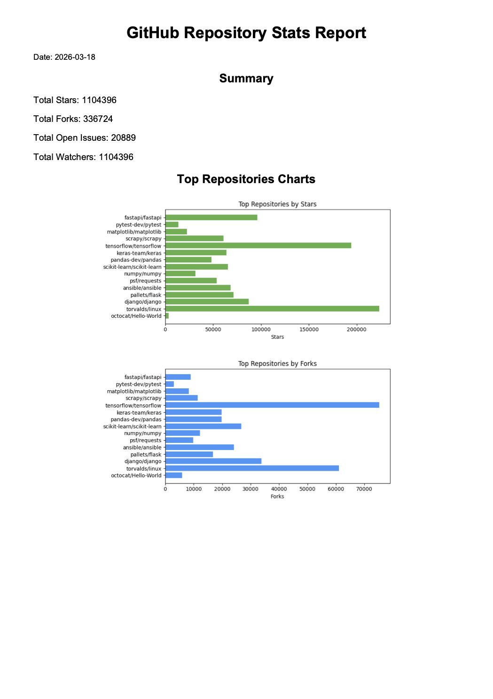

# github_api_repo_tracker
GitHub repository stats tracker that automatically fetch key statistics of GitHub repositories and generate a report (CSV or PDF) for monitoring performance over time. It generates a pdf report with data visualizations, graphs and a table.

## Project overview
This project demonstrates a full workflow for automating data collection, analysis, and reporting using Python:
- Fetch live statistics from a list of GitHub repositories via the GitHub API.
- Store historical data in a CSV file for trend tracking.
- Generate insightful graphs and charts (bar charts, pie charts) using Matplotlib.
- Automatically create a professional PDF report using an HTML template and pdfkit.
- Designed for freelancers or teams who want to track repository metrics over time for clients or internal reporting.

## Features
- Fetch the following repository metrics:
    - Stars
    - Forks
    - Open Issues
    - Watchers
    - Last Push Date
- Generate summary statistics (total stars, forks, issues, watchers).
- Create visualizations:
    - Horizontal bar charts for top repositories by stars or forks.
    - Pie chart showing proportional distribution of stars.
- Save historical data to a CSV for tracking trends.
- Export all results in a ready-to-share PDF report.
- Fully configurable HTML template for the report allows user to change anything they want in its appearance.
- Fully configurable repository list and output locations.
- Supports GitHub API tokens for higher request limits.

## Project structure
```
github-stats-report/
│
├─ output/                  # CSV and PDF reports
├─ resources/               # HTML template, example screenshots
├─ main.py                  # Main Python script
├─ .env                     # Optional, for GitHub token
└─ README.md
```

## Technologies used
- Python 3.12+
- Requests (API requests)
- Pandas (data manipulation)
- Matplotlib (data visualization)
- Jinja2 (HTML templating)
- pdfkit / wkhtmltopdf (PDF generation)
- GitHub REST API

## Possible improvements
Lots of features can be added or improved, such as
- Creating more advanced or personalized statistics
- Generating a different, bigger, or more complete report
- ...

## Example output
In its current state, the code tracks 15 of the most used repositories on github, and the report looks like this:

